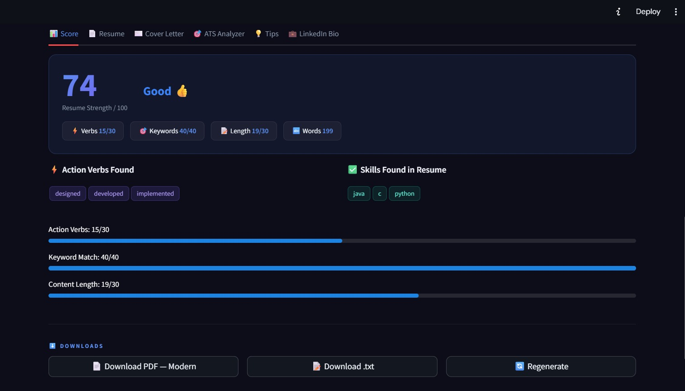
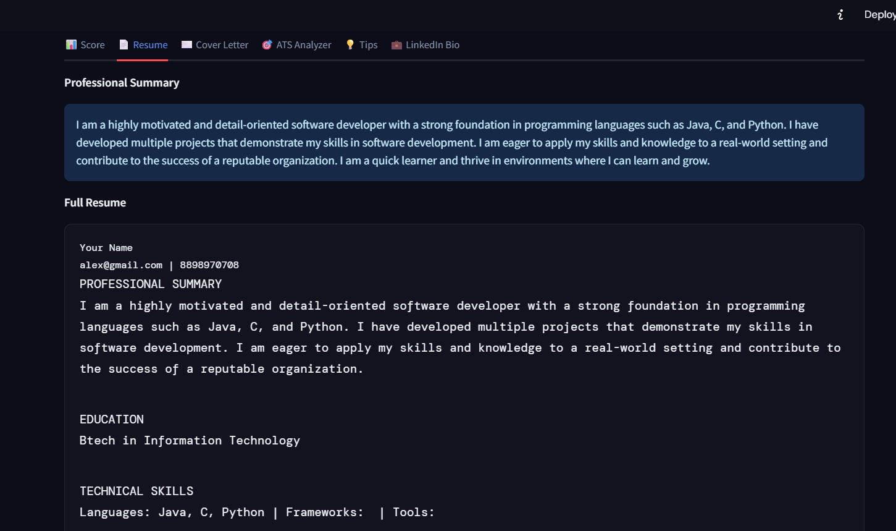
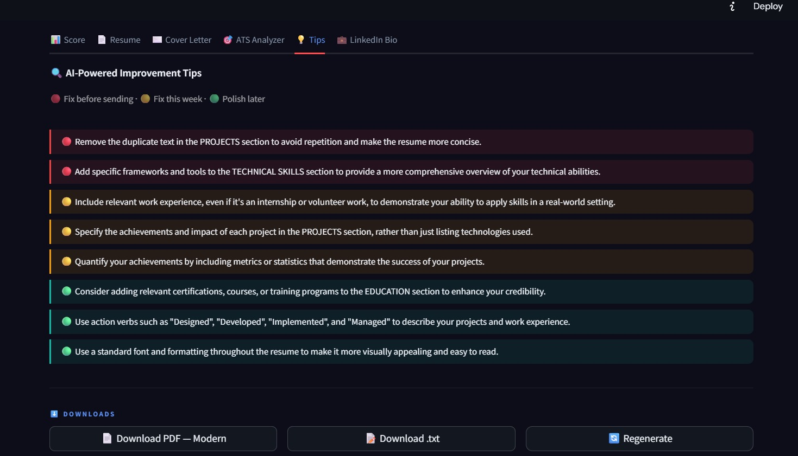

# 🚀 AI-Powered Resume & Career Suite

> **Capstone Project** | Advanced Generative AI | Python · Streamlit · Groq LLaMA 3.3

A high-end, ATS-optimized document generator that transforms raw experience into professional career assets. Built for modern job seekers, this suite goes beyond basic templates to provide deep NLP-driven analysis, LinkedIn branding, and tailor-made career advice.


---

## 💎 Features at a Glance

### 1. 📊 Intelligent Resume Evaluation
Get instant feedback with our **Resume Strength Scorer**. It analyzes action verb density, keyword relevance, and content volume to give you a transparent "ATS Grade."



### 2. 📄 Professional Document Generation (v2)
- **3 Premium Layouts**: Choose between *Modern*, *Classic*, or *Minimal* PDF templates.
- **ATS-Optimized**: Single-column vertical flow designed to be parsed by 99% of Applicant Tracking Systems.
- **Auto-Formatting**: Smart bullet-point detection and accent-colored dividers.



### 3. 🎯 ATS Job Description Analyzer
Paste any job description to perform a **Gap Analysis**. The AI identifies missing keywords, matches your skills against requirements, and gives you "Quick Wins" to boost your match score.


### 4. 💼 LinkedIn Bio & Career Kit
- **LinkedIn Generator**: Create a hook-first, professional "About" section following branding best practices.
- **Tailored Cover Letter**: Persuasive, role-specific drafting on a separate professional page.
- **Improvement Tips**: 8 prioritized AI tips (🔴 critical to 🟢 polish) based on your target role.


<!-- slide -->

<!-- slide -->


---

## 📋 Academic Structure (Capstone Requirements)

| Section | Focus |
|---|---|
| **Problem Statement** | Automating professional document creation for students & freshers to bridge the writing skills gap. |
| **Proposed Solution** | A zero-shot NLG system using **LLaMA 3.3 70B** and structured prompt engineering. |
| **System Approach** | Modular Python architecture with a rule-based NLP evaluation engine and Streamlit UI. |
| **Algorithm** | Transformer-based autoregressive decoding + regex feature extraction for scoring. |
| **Conclusion** | Proves that context-aware AI generation significantly outperforms static template-based builders. |

---

## 🔬 AI/ML Concepts Used

- **Transformer Architecture (LLaMA)**: Leverages self-attention to understand context across all input fields simultaneously.
- **Prompt Engineering**: Uses structured system-defined "personas" to enforce consistent, professional output formats.
- **NLP Feature Extraction**: Rule-based regex engine for action verb counting and multi-word keyword matching.
- **Heuristic Scoring**: A weighted mathematical model (Verbs + Keywords + Length) to simulate recruiter quality checks.

---

## 🏗️ Project Structure

```bash
AI-Resume-Builder/
├── app.py              # Main Streamlit UI & Theme Engine
├── utils.py            # AI Pipeline, PDF Generator & Scorer
├── requirements.txt    # dependencies
└── outputs/
    ├── img/           # README Screenshots
    └── ...            # Generated PDF assets
```

---

## ⚙️ Setup & Installation

### Local Development
1. **Clone the repo** & navigate to the folder.
2. **Install Requirements**:
   ```bash
   pip install -r requirements.txt
   ```
3. **Configure API Key**:
   Create a `.env` file or enter your **Groq API Key** (v2 supports free tier) directly in the UI.
4. **Run App**:
   ```bash
   streamlit run app.py
   ```

### 📦 Dependencies
- `streamlit`: Core UI framework
- `groq`: LLaMA 3.3 70B inference
- `fpdf2`: Advanced PDF generation engine
- `python-dotenv`: Environment management

---

## 📚 References
1. **Vaswani et al. (2017)** — *Attention Is All You Need*.
2. **Brown, T. (2020)** — *Language Models are Few-Shot Learners*.
3. **Meta AI (2024)** — *LLaMA 3.3 Technical Documentation*.

---
*Developed by the AI Resume Builder Team | Built with Python & Streamlit | 2024*
